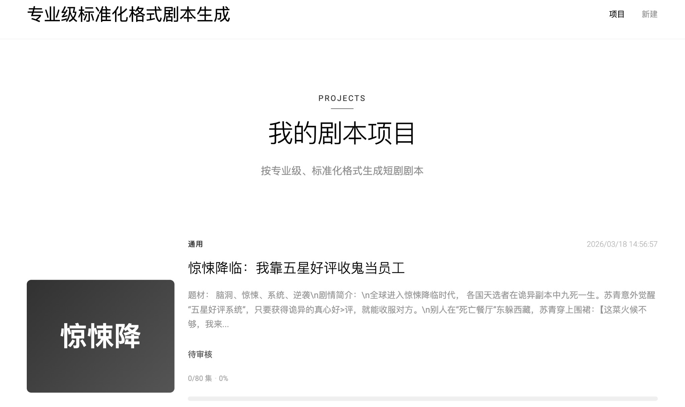
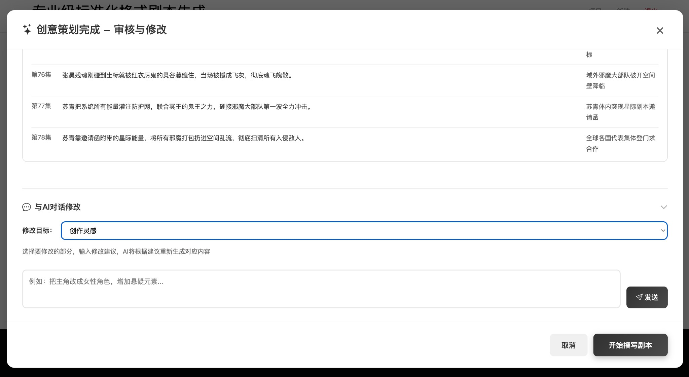
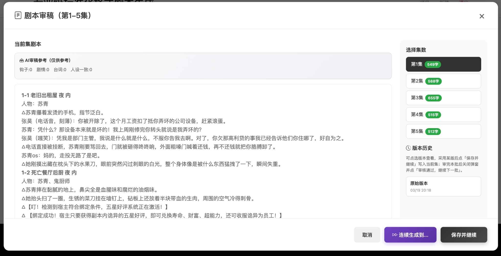

# Professional Drama Script Generator

面向短剧创作的分阶段剧本生成工具。

从灵感策划、结构搭建到分批撰写与结果导出，全部流程都可以在一个 Web 界面里完成。

---

### 🌐 在线体验

无需部署，直接访问：**[https://drama.shakedrama.lol](https://drama.shakedrama.lol)**

打开即用，注册账号后即可体验完整流程；也支持切换成你自己的模型接口配置。

---

## 为什么用它

它不是一次性吐一段文本，而是把短剧创作拆成可推进、可审阅、可继续生成的完整流程：

- 先策划，再撰写，过程更稳定
- 每个关键阶段都能查看、编辑、继续推进
- 支持多集连续创作，适合系列短剧项目
- 支持导出 Word，便于交付、修改和存档

## 核心能力

- Web 可视化操作界面
- 用户注册与密码登录
- 自定义 API Key、Base URL、模型名称
- 保存多套模型配置并直接切换
- 分阶段推进剧本生成流程
- 支持过程审阅、续写与导出

## 产品预览

### 📋 主页面

项目集中管理，快速查看进度并继续创作。



### 🎨 策划阶段

从创作灵感到分集规划，逐步搭好完整剧本蓝图，并支持边审边改。



### ✍️ 撰写阶段

按批次生成剧本正文，支持逐步续写、版本回顾、日志查看和导出。



## Quick Start

### Requirements

- Python 3.10+
- Linux 或 macOS

### Install

```bash
pip install -r requirements.txt
```

### Configure environment

如需使用环境变量文件，先复制示例：

```bash
cp .env.example .env
```

项目默认不内置任何私有域名或 API 配置。你也可以在启动后直接通过网页为不同用户分别配置模型接口。

### Run

```bash
bash run_local.sh
```

或者直接运行：

```bash
python3 app.py
```

默认访问地址：

- `http://localhost:8502`

## How to use

### Step 1: Register

首次访问时注册账号并设置密码即可登录使用。

### Step 2: Add a model profile

进入新建页面后，先添加你的模型接口配置，至少需要填写：

- 配置名称
- API Key
- Base URL
- 模型名称

这意味着你可以接入任何兼容 OpenAI 风格的模型服务或自建网关。

### Step 3: Create a project

选择一个已保存的接口配置，填写项目需求与基础参数后即可创建剧本项目。

### Step 4: Generate by stages

在项目详情页中，按阶段推进策划与撰写流程，查看生成日志，并在合适的节点继续下一步。

### Step 5: Export results

完成后可以导出：

- 创意策划文档
- 完整剧本文档


## Project structure

```text
ShakeDrama/
├── app.py
├── run_local.sh
├── .env.example
├── requirements.txt
├── README.md
├── web/
└── drama_agent/
```

## Notes

1. 本项目不附带任何商业模型授权
2. 使用者需要自行提供合法可用的模型接口
3. 当前默认采用文件存储，更适合单机部署、演示和二次开发
4. 如果要用于正式线上服务，建议迁移到数据库与对象存储

## License

本项目采用 [Apache License 2.0](./LICENSE) 开源发布。

你可以在遵守 Apache-2.0 条款的前提下使用、修改和分发本项目。
